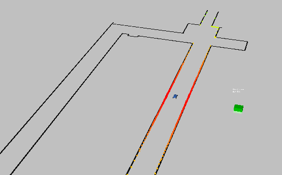
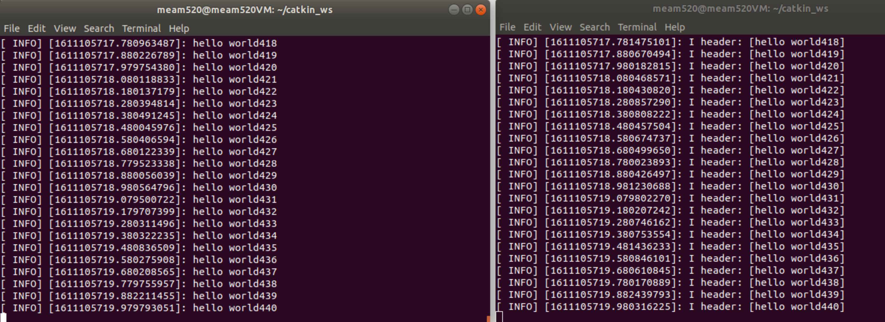
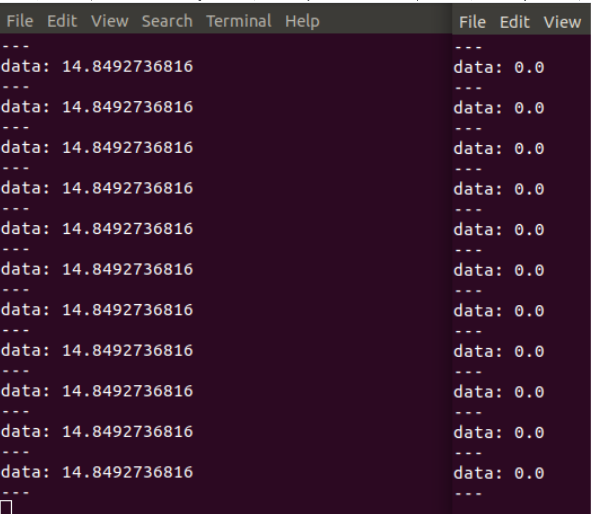

I am taking an independent study course (ROBO 599) focused on autonomous vehicles which is taught by the Penn F1Tenth team. The first portion of the course is to go through some of the introductory labs to get familiarized with ROS.

The first lab prompt is available <a href="https://drive.google.com/file/d/1p-XJmLWq6MfYiHIBPVSEkmM_7eD2a-f9/view">here</a>, and the following is my response.

Sec. 3: Workspaces and Packages
--------------------------
The first portion of the lab had us get familiarized with the directory structure of ROS. I followed the ROS tutorials for creating a <a href="http://wiki.ros.org/catkin/Tutorials/create_a_workspace">workspace</a> and <a href="http://wiki.ros.org/ROS/Tutorials/CreatingPackage">package</a>  in both C++ and Python.

I first created a new Catkin workspace, called "catkin_ws". Within that subdirectory, I created a new package called "wesley_yee_ws". I think this is probably incorrect, and I should have labeled it as a package, but it's just a beginner tutorial. The package.xml file was fairly simple to modify, since catkin did most of the heavy lifting. 

```
<?xml version="1.0"?>
<package format="2">
  <name>The wesley_yee_ws package</name>
  <version>0.0.0</version>
  <description>The wesley_yee_ws package</description>

  <maintainer email="wesyee@seas.upenn.edu">Wesley Yee</maintainer>

  <buildtool_depend>catkin</buildtool_depend>
  <build_depend>roscpp</build_depend>
  <build_depend>rospy</build_depend>
  <build_depend>std_msgs</build_depend>
  <build_export_depend>roscpp</build_export_depend>
  <build_export_depend>rospy</build_export_depend>
  <build_export_depend>std_msgs</build_export_depend>
  <exec_depend>roscpp</exec_depend>
  <exec_depend>rospy</exec_depend>
  <exec_depend>std_msgs</exec_depend>

<export>

  </export>
</package>

```
Sec. 3 Answers to Questions:
--------------------------
1. A CMakeList is basically a manifest which describes a project’s source files, dependencies, and targets. CMakeLists is related to make files, which details the build process every time you compile your program (i.e. determining proper order for updating files, knowing which specific files to update when a dependency is updated, etc). CMake just stands for Cross-platform Make, and allows you to build programs regardless of the specific compiler that you have installed on your computer. This makes it easy to share a program with someone else who may not have the same compiler you have and still have the program run just fine.
2. Yes, you still need to use CMakeLists.txt for Python in ROS. Yes, there is an executable object that needs to be created in the bin subfolder for each Python package.
3. You should run catkin_make in the top level src directory (in this case it would be in  “wesley_yee_ws/src”).
4. The source command runs the specified bash script in the unix shell. What the setup.bash script does is set various environment variables in the unix OS so that ROS will be able to locate the binaries for execution. The first line sets environment variables to allow the ROS distribution to function, and the second line sets the environment variables for the particular local workspace that you are working in.

Section 4: Publishers and Subscribers
--------------------------
I next followed the implemented publishers and subscribers ROS tutorials (available <a href="http://wiki.ros.org/ROS/Tutorials/WritingPublisherSubscriber%28c%2B%2B%29">here</a>) for C++. This section proved to be fairly challenging due to my unfamiliarity with CMakeList.txt as well as getting used to C++ syntax. Although I have a pretty decent background in other statically typed languages (Java, C#), C++ is very picky! That combined with the fact that I was using ROS libraries made it a bit more difficult to implement.

I was able to implement the tutorials' publish and subscribe examples, which were fairly straightforward. The images below show the talker.cpp speaking over the "chatter" topic, while the listener.cpp is listening. They are just saying "hello world" with a loop count attached to it.



Next, it was time to start interfacing with the F1/Tenth programs. The first task was to implement my own node, which I called lidar\_sub.cpp, that would subscribe to the "/scan" topic outputted by the 2D Lidar scanner. Afterwards, I added a publisher to the same node which outputted the closest and farthest read points to "/closest\_point" and "/farthest\_point" topics, respectively. I was stuck on this section for a while, since it was initially difficult to get accustomed to ROS's std\_msgs types. 

The "/furthest\_point" output data is on the left and "/closest\_point" output data is on the right in the image below.



I've added my C++ code below.

```
#include "ros/ros.h"
#include "sensor_msgs/LaserScan.h"
#include "std_msgs/Float32.h"

std_msgs::Float32 max;
std_msgs::Float32 min;

void scanCallback(const sensor_msgs::LaserScan & msg)
{	
    for(unsigned int i=0 ; i < sizeof(msg.ranges)/sizeof(msg.ranges[0]); i = i + 1){
		if (!std::isinf(msg.ranges[i]) || !std::isnan(msg.ranges[i])){
			if (msg.ranges[i]<min.data){
				min.data = msg.ranges[i];
			}
			if (msg.ranges[i]>max.data){
				max.data = msg.ranges[i];
			}
		}
    }    
}

int main(int argc, char **argv)
{
    ros::init(argc, argv, "lidar_sub");

    ros::NodeHandle n;
    
	ros::Subscriber sub = n.subscribe("scan",100, scanCallback);
	ros::Publisher pub_closest = n.advertise<std_msgs::Float32>("closest_point",100);
	ros::Publisher pub_furthest = n.advertise<std_msgs::Float32>("furthest_point",100);
	
	ros::Rate loop_rate(10);
	
    while (ros::ok()){
    	pub_closest.publish(min);
    	pub_furthest.publish(max);
    	
    	ros::spinOnce();
    }
    
    ros::spin();
        
    return 0;
}

```
Sec. 4 Answers to Questions:
--------------------------
1. ROS NodeHandles is the access point for communications with the ROS system. It also allows for an extra namespace layer to specify object names. You can have multiple node handle objects within the same node. You would do this if you wanted to make a private node handle so that you can specify parameters that are relative to the local node for avoiding collisions.
2. 
3. ros::spinOnce() and ros::spin() are message callback handlers. The difference is that spinOnce() only executes the callback function once, and if you want to execute it multiple times, then you need to add it within a while or for loop. The main use case is when you want to specify the loop rate, you'd use spinOnce(). On the other hande, spin() is used by itself and executes the same callback functionality as spinOnce, but it automatically loops without an external loop.
4. ros::rate() sets the frequency with which to execute a loop and is mainly used in conjunction with ros::spinOnce(). For example, setting ros::rate(10) would execute the loop at a rate of 10 Hz, or 10 loops per second.
5. 

