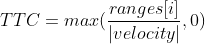

This lab focuses on building a safety node for race cars that will stop the car from collision when traveling at higher velocities. I implement Time to Collision (TTC) using the LaserScan message in the simulator.

The Github code for the safety package is available <a href="https://github.com/wesleyyee1996/f1tenth_labs/tree/master/src/safety">here</a>.

The second lab prompt is available <a href="https://f1tenth-coursekit.readthedocs.io/en/stable/assignments/labs/lab2.html">here</a>, and the following is my response. 

I created the safety node in C++ and subscribed to the /odom and /scan topics in order to get the velocity data of the car as well as the lidar scan data to tell the distance of various surrounding walls. Additionally, when it was determined that the car was about to crash, a speed of 0.0 was sent to /brake channel in an AckermannDriveStamped object while a bool of false was sent to /brake\_bool channel.

The /scan data provides a LaserScan message object, which provides 360 degree data around the car. 

Something which initially puzzled me was figuring out where the zero degree mark was, since the LaserScan documentation stated that it started at the conventional positive x axis. However, I found this wasn't the case, so I parked the car and took the first message that the /scan topic was outputting using "rostopic echo -n1 /scan", then plotted the data using Excel, as seen below.

From there, I took various measurements in Rviz and found that the zero index was actually at the south facing direction of the car, since it starts at 14.7 meters from the back while the front is a long hallway about 50ish meters away.

Next, I decided to use a simple method of checking the front and back of the car, since it's highly unlikely for the vehicle to collide with a wall on the side due to the non-holonomic nature of the vehicle. I access the float array "ranges" in the LaserScan message. ranges has 1080 indexes, with each index i holding the distance of any object at (i steps)*(6.28319rad)/(1080 steps) radians. Since I only want the front and back sections, I limited the front range to be [400,600], and the back to be [0,100] and [979,1079]. You can see this illustrated in the diagram below.

The TTC is then calculated as:

If TTC is below a tuned threshold, which I set to 0.3 seconds, then the car will brake. You can see a demo below.

<iframe width="560" height="315" src="https://www.youtube.com/embed/shFCuZ_6hIA" frameborder="0" allow="accelerometer; autoplay; clipboard-write; encrypted-media; gyroscope; picture-in-picture" allowfullscreen></iframe>

