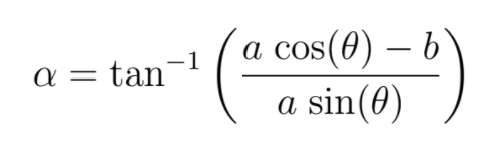
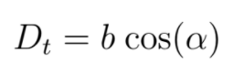

In this lab, I implemented a PID controller to make the car drive parallel to the walls of a corridor at a fixed distance.

You can view the Github code <a href="https://github.com/wesleyyee1996/f1tenth_labs/tree/master/src/wall_follow">here</a>. 

By using the distances from the laser scan, it is possible to calculate the car's current distance from the wall using the following diagram:

If we obtain two laser scan distances a (between 0-70 degrees) and b (at 0 degrees) to the wall along with the known theta, it is possible to determine alpha--the car's current angle from the wall using the following trigonometric relation:

Furthermore, we can then express D_t as:

Now to calculate the error term, we simply subtract D_t from our desired set point, which I set to be 1 m from the wall.

This method works for slow speeds; however, since the car will be operating at high speeds, the directions may be sent too late and thus lead to a crash. Therefore, we calculate a new distance (D_{t+1}) defined by a certain lookahead distance (L) using the following diagram:

Next, I calculate the PID equation to retrieve the output steering angle. A big portion of this lab was tuning the PID parameters properly. What I ended up doing was setting Kp = 1.2, Kd = 0.04, and Ki = 0. I found that increasing Kp increased the overall "strength" of the steering angle, while increasing Kd increased the responsiveness to large errors. If Kd was set too high, then the car would start to oscillate too much. Further, Ki was meant to settle the steady state error; however, in practice I found that this did not really do much and usually caused the car to slowly drift closer and closer to the wall until it crashed.

I also found that the parameter theta needed to be tuned. Decreasing theta caused the car to be more responsive to left turns, but if too small would cause the car to be unstable. Increasing theta caused the car to be more stable, but often led to making left turns too early as it would detect a left turn and turn into the wall corner. Ultimately, I settled on setting theta to 60. Additionally, I set the lookahead distance L = 0.5m.

The last difficult part of this lab was tuning the parameters such that it would be able to make it around the full track, with the bottom cove presenting many difficulties. I have yet to tune the parameters such that the car is able to make it past this.

Lastly, I set the velocity of the car based on the steering angle. If steering angle < 0.2, then V = 1.5m/s. If steering angle between 0.2 and 0.3, then V = 1.0m/s. Then, if steering angle > 0.3, V = 0.5m/s.

You can view the video below:
<iframe width="560" height="315" src="https://www.youtube.com/embed/mLh02_8KSe0" frameborder="0" allow="accelerometer; autoplay; clipboard-write; encrypted-media; gyroscope; picture-in-picture" allowfullscreen></iframe>