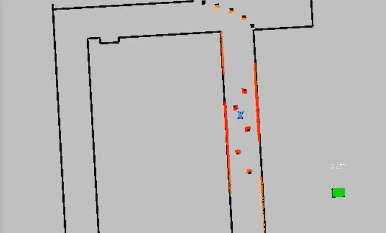

In this lab, I implement a reactive algorithm for obstacle avoidance by "following the gap" read by the laser scan.

A naive implementation of this approach is simply to detect all points in the laser scan with distances greater than a set threshold, then directing the car to the largest gap within the set. 

However, it quickly becomes apparent that for trickier situations, such as those with multiple overlapping obstacles, this does not work due to the non-holonomic nature of the vehicle. If the car decides to follow the gap, it will collide with the first barrier.

Thus, a better approach is to use the method which was implemented by the University of North Carolina team in their 2019 Montreal Grand Prix entry:

<iframe width="438" height="329" src="https://www.youtube.com/embed/ctTJHueaTcY" frameborder="0" allow="accelerometer; autoplay; clipboard-write; encrypted-media; gyroscope; picture-in-picture" allowfullscreen></iframe>

The idea is to find the nearest LIDAR point and put a "safety bubble" around it of radius rb, which I set to be the width of the car (0.55m). Then, set all points inside the bubble to a distance of 0. The rest of the nonzero points are considered 'free space'. Then, the maximum sequence of non-zeros is determined to be the max gap. I then set the furthest point in the free space to be the goal point. 

Lastly, I set the velocity of the car based on the steering angle. If steering angle < 0.05, then V = 1.5m/s. If steering angle is between 0.05 and 0.1, then V = 1.0m/s. Then, if steering angle > 0.1, V = 0.5m/s.

You can see a demo of the implementation below. While this algorithm is great for avoiding obstacles, it is quite difficult to determine which is the correct best point to follow when there are two seemingly great options. As seen below, I try to force the car to turn left at the first turn, but it decides to avoid the blocking obstacles and instead goes past them!

<iframe width="560" height="315" src="https://www.youtube.com/embed/i7uwwDOwg2Y" frameborder="0" allow="accelerometer; autoplay; clipboard-write; encrypted-media; gyroscope; picture-in-picture" allowfullscreen></iframe>