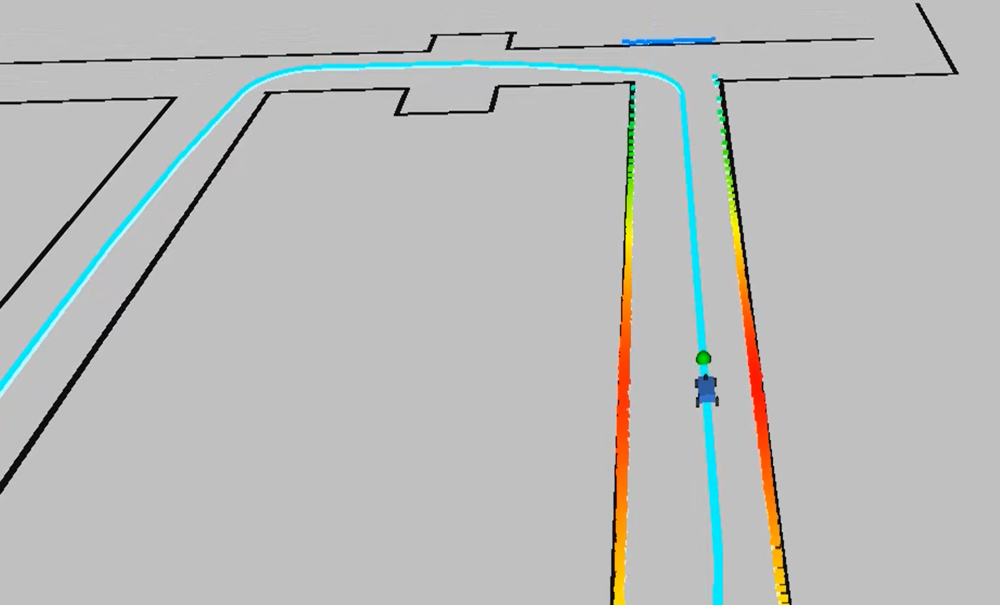

In this lab, I implement the pure pursuit trajectory planning algorithm. Given a set of waypoints to follow, the vehicle is able to plan a local path in order to follow those waypoints.

You can find the Github code <a href="https://github.com/wesleyyee1996/f1tenth_labs/tree/master/src/pure_pursuit">here</a>. Additionally, the lab from the F1Tenth website can be found <a href="https://f1tenth-coursekit.readthedocs.io/en/stable/assignments/labs/lab6.html">here</a>.

The first step in this lab was to create a set of waypoints (in the map's global frame) for the vehicle to follow. I did this by driving around the map and using the waypoint_logger node to save the waypoints into a csv file. From here, I then filtered the points such that there were 1000 waypoints to follow. You can see the visualization of the waypoints in the map below highlighted in blue.

The most difficult portion of the lab was to locate the current waypoint to follow. The strategy I used to do this is to define a lookahead distance L and create a circle around the car with radius L. Then, by constraining the circle to the 90 degrees in front of the car, I search through the entire list of waypoints and find the closest point to the circle on the outside. You can see this below:

The selected waypoint is visualized in the actual simulation as the green dot. Next, I needed to transform the position of the selected waypoint and the car from the global frame to the car's frame. This is done by using a homogeneous transformation matrix. If we know the current angle of the car (theta) in the global frame based on the defined coordinate axes below, we can plug this into the standard rotation matrix about the Z-axis along with the translation component of the car's current position.

Now with the desired waypoint in the car's local frame, I could easily calculate the desired steering angle of the car using the following relation, where gamma is proportional to the steering angle.

This method of control was very similar to Proportional control, so I actually needed to multiply the desired steering angle by a Kp value, which I set to 0.5. Additionally, I needed to tune the lookahead parameter L, which I set to 1m. Then, setting the desired speed to 2 m/s, I was able to achieve fairly robust results with the car following the desired path quite well!

<iframe width="560" height="315" src="https://www.youtube.com/embed/LOzY6f9O2ik" frameborder="0" allow="accelerometer; autoplay; clipboard-write; encrypted-media; gyroscope; picture-in-picture" allowfullscreen></iframe>

