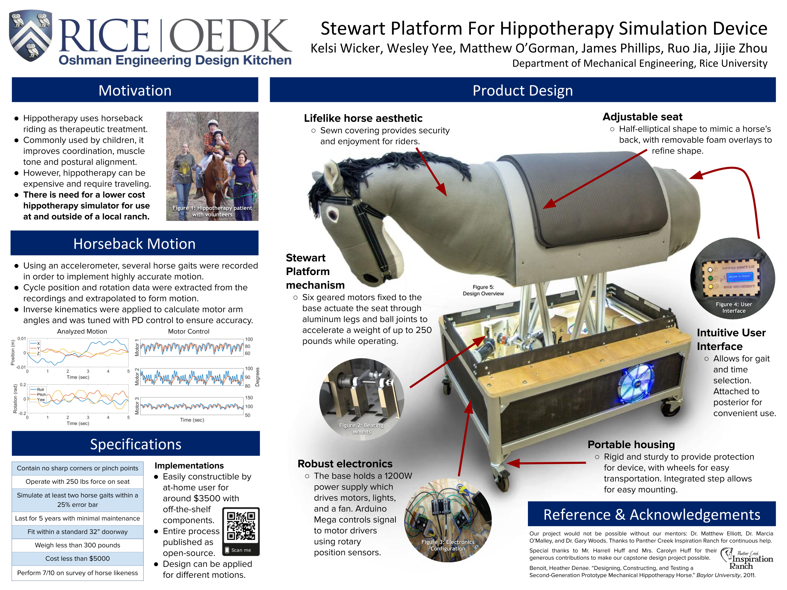

My senior design team (Kelsi Wicker, Matthew O'Gorman, James Phillips, Ruo Jia, Jijie Zhou, & myself) built a robotic horse (aptly named Stewie) using a 6-DOF Stewart Platform to accurately mimic various gait cycles used during hippotherapy. 

By specifying the position and orientation of the horse's back at any given time, the seat could navigate to the corresponding location by moving each of 6 motors to a calculated position. The device was able to recreate any gait cycle within the workspace instantaneously, which was advantageous over mechanical mechanisms, which were limited to singular, cyclical motions.  We used an Arduino as the controller, and using the rotary position sensors on the motor shafts as feedback, were able to use PID control and inverse kinematics to set the desired motor speed and position.

This project was named as a 2018 finalist for the World Congress of Biomechanics Undergraduate Design Competition in Dublin, Ireland. Our design team was fortunate to receive full funding to send everyone on the trip!

The poster for the end-of-year design showcase is below.

