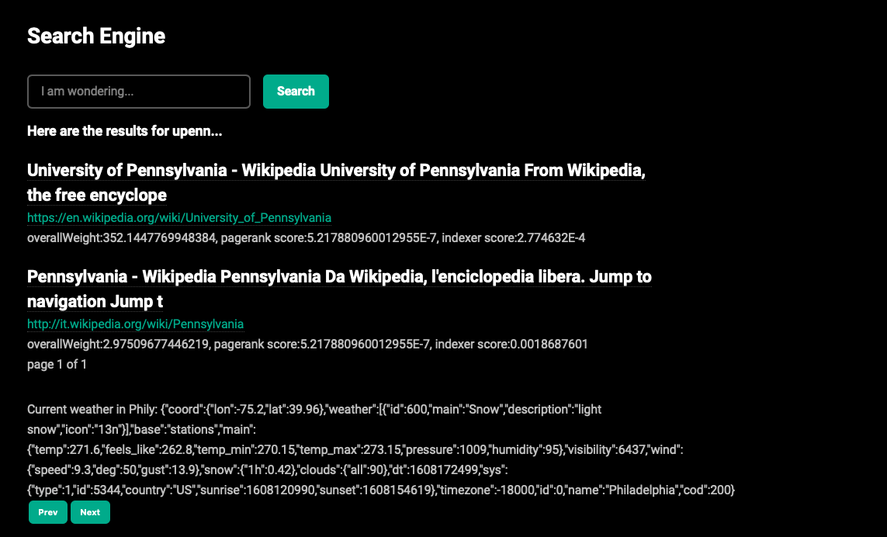
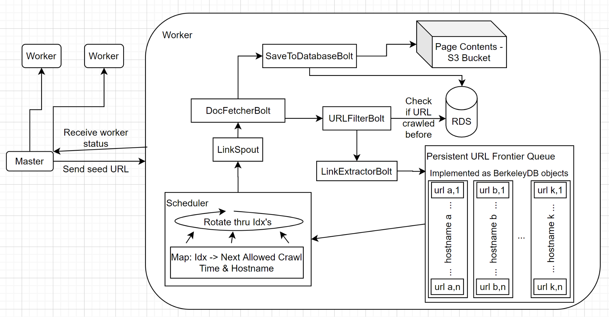
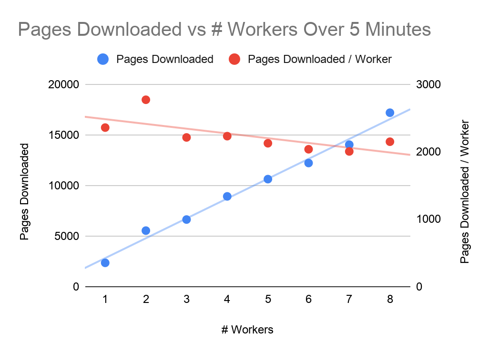

 
Over the course of two weeks, my CIS 555 team (Lihao Zhu, Rakesh Nagda, Meiwen Zhou, & myself) built a distributed, fault-tolerant search engine inspired by Google which was completely hosted on AWS. As the project was quite large, the main functionality was broken into four sub-components:
- a scalable, distributed Crawler capable of downloading 160,000+ pages per hour.
- an agile Indexer which is highly scalable given its distributed database, and which responds in less than 0.2 seconds even to long queries.
- a Pagerank component that computes score for each page efficiently and mitigates pagerank sink & hoarding & dangling links. Also provides data access through web API or database query. 
- a Search Engine which returns relevant results in real-time by querying all the other components above.  

 

Crawler
--------------------------
My main contribution to the project was building a Mercator-style web crawler that would generate the corpus for the other components to access. The crawler consisted of 8 distributed worker nodes and a single master node, all running on separate AWS EC2 instances. Due to limitations of AWS Educate accounts, I was limited to 9 separate EC2 instances, but on a normal account, would most likely have increased it to ~20 workers. Each crawler node utilized a "lite" version of the Apache Storm stream processing engine, which allowed for parallel processing. Webpage metadata was saved into an AWS RDS MySQL database, while the actual webpage contents were stored in an S3 bucket. For the web server, I used the Spark Java API. The diagram below shows a rough outline of the architecture.
   

   
A major challenge when constructing the crawler was detecting and avoiding crawler (aka spider) traps. To overcome this, I implemented a URL Frontier queue in BerkeleyDB which varied the top-level-domain hostname that was sent to each worker and also allowed for larger-than-memory support. This resulted in a very diverse crawl while guaranteeing internet politeness, such that at most one worker requested from a single domain at a given time and respected robots.txt files. 
   
A second challenge was working within the limitations of the AWS Educate account since it didn't allow for creation of IAM roles. As a result, I wasn't able to use AWS Systems Manager to run shell commands on the worker instances remotely, and starting each worker manually proved to be a huge time sink. Additionally, as web crawling is computationally intensive by nature, I found out that I had run out of AWS Educate credits the morning of the final demo, which almost caused all of my AWS data to be deleted. Fortunately, AWS was kind enough to provide an extra 20 credits at no charge due to the circumstances!
   
In the end, the web crawler was able to download ~1.5 million web pages at a peak rate of 160,000+ pages per hour and occupied ~170 GB of disk space. The diagram below shows the crawling performance compared to the number of worker nodes. 

This was definitely one of the most challenging projects that I have worked on, but also the most rewarding. Distributed systems has to be one of the most fascinating fields in CS, and I have no doubt that this experience will prove to be extremely beneficial in my future robotics career.

You can view the final project report below:

 <object data="https://s3.us-east-2.amazonaws.com/wesleyyee.com/555final.pdf" type="application/pdf" width="100%" height="700px">
    <embed src="https://s3.us-east-2.amazonaws.com/wesleyyee.com/555final.pdf">
        
This browser does not support PDFs. Please download the PDF to view it: <a href="https://s3.us-east-2.amazonaws.com/wesleyyee.com/555final.pdf">Download PDF</a>.

    </embed>
</object>

