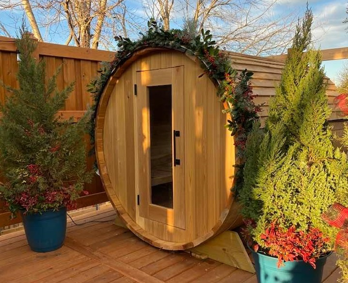

The COVID-19 pandemic presented a unique opportunity for working on home improvement projects due to shelter-in-place orders. Since Penn conducted the entire 2020-2021 school year online, I moved back in with my parents temporarily for my first year of grad school. 

After experiencing "fire and ice" therapy from a gym in Houston (derived from the Finnish sauna tradition), I had wanted to my own cedar barrel sauna for some time. However, sauna kits for this particular model from various retailers ranged from $9-12k for knotty cedar and had about a 2 month back-order. So I decided to build my own from scratch on a budget while learning more about woodworking in the process.

The first major challenge was coming up with the design. After scouring the internet for a few days with no luck finding designs from other people, I proceeded to create my own model in Fusion 360. This was an exercise in patience and doing things the right way, since the last time I worked in Fusion 360 was designing my electric longboard and I didn't follow best design practices back then. The biggest struggle was the understanding differences in workflow between SolidWorks (which I had first learned CAD) and Fusion 360. In SolidWorks, you design each component in separate files, then have a larger assembly file to combine everything. However, in Fusion 360, you design everything in one file with "components" and assemble them with "joints". Personally, I think this method is a bit cleaner w.r.t version control and you don't have to worry about part files going missing. 

You can take a closer look at the CAD model below. I removed the top staves so it's easier to see inside. Additionally, the door frame has a single section of pine so that I know the direction is up (of course, this was switched out during construction)

<iframe src="https://myhub.autodesk360.com/ue2b583ae/shares/public/SH919a0QTf3c32634dcf91253fa6f47cc4cd?mode=embed" width="800" height="600" allowfullscreen="true" webkitallowfullscreen="true" mozallowfullscreen="true"  frameborder="0"></iframe>

The next major challenge was actually constructing the sauna. I purchased 150-2x6x8 cedar boards from Lowe's and had them delivered to my house (only cost $20 and saved me a ton of work). Since Lowe's doesn't carry A grade boards, I selected the boards with the fewest knots (and found quite a few clear ones!), then returned the other 75. 

I used a thickness planer to first remove the rough surface from the boards. Then I used tongue-and-groove router bits to cut the side profile on front and back face boards, then bead-and-cove router bits to cut the side profile on the side staves. For the cradle support, I cut out 5-2x12x12 pressure-treated pine boards, then assembled everything together using steel cable. I've added the images below.
<iframe src="https://albumizr.com/a/Z2i7" scrolling="no" frameborder="0" allowfullscreen width="700" height="400"></iframe>
The final challenge was doing the electrical wiring. After getting various quotes from electricians in the area, I decided to wire it up myself with some guidance from electrician forums, YouTube videos, and getting up to date with local residential building codes. The heater I selected was an 8kW Harvia KIP 80-B. I used 10/3 NM-B wire from the breaker panel through the attic to the 40A GFCI subpanel in the backyard. From there, I routed 10/3 UF cable in metal conduit buried 18" deep from the side of the house to the sauna. Since this was my first time working with 240V, I was a little nervous at first, but with due diligence and lots of testing, I was able to finish this portion of the build.

In the end, I completed this project for a little over $3500 (including electrical) and gained a ton of great learning experiences! The most satisfying part was being able to relax in the sauna for the first time with my family. We've been using it almost every day, and the total cost of electricity for the entire month is only $30 in the winter.
