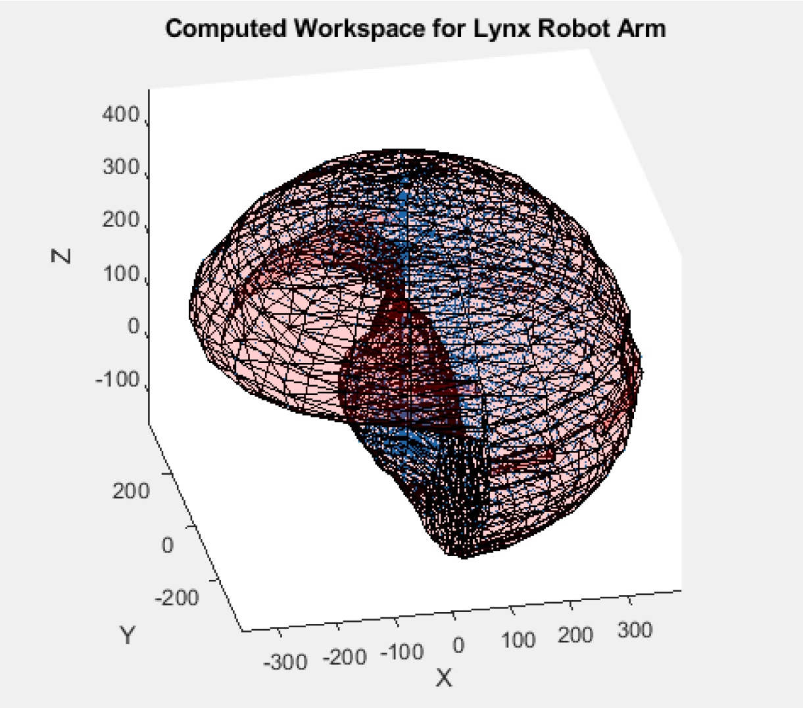
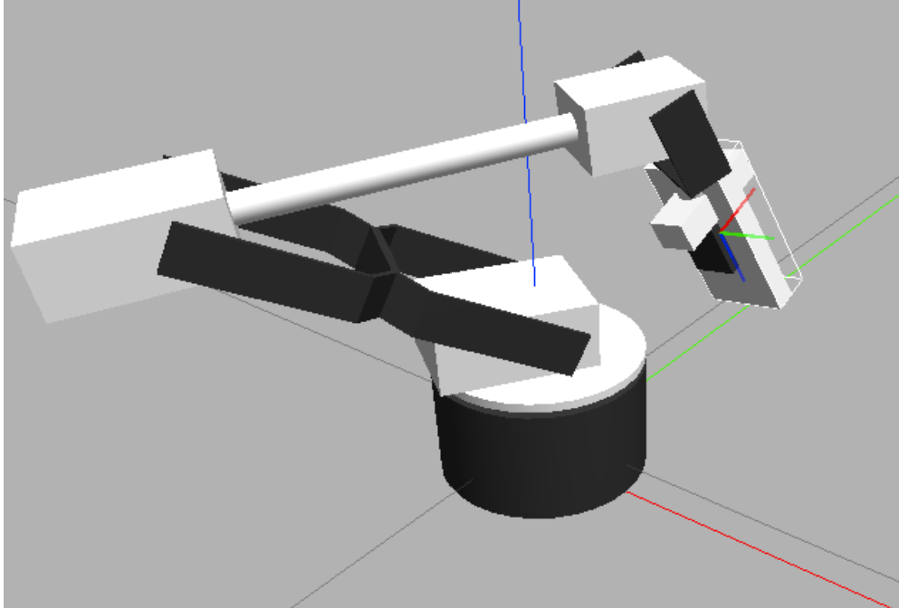

Overview
--------------------------
This was a series of projects in my MEAM 520 (Introduction to Robotics) class where we used a 6-DOF Lynx manipulator robot in ROS and wrote various controllers for it in MATLAB. I worked with Shaun Fedrick on the first 5 labs, and then also with Jia Shen and Anamil Mehta for the final project. Throughout the semester, we worked on a variety of projects including forward, inverse and velocity kinematics, and path planning using RRT* and artificial potential fields. For the final project, the objective was to write the controller for the robot arm to pick up and place blocks in a ROS simulation. The class was broken up into teams, who then competed with each other as either the red or blue robots at the end of the semester.

Forward, Inverse, and Velocity Kinematics
--------------------------
We first familiarized ourselves with homogeneous transformations and how they could be applied to forward kinematics using DH convention. Additionally, we also explored differences between robot workspace and configuration space. Next, we delved into inverse kinematics and various methods to solve for desired positions for the 6-DOF robot. As the robot was unable to yaw at the wrist, various desired positions were ruled as infeasible even though they were in the reachable workspace. For infeasible configurations, we calculated the closest feasible configuration according to the L2 norm in configuration space. Seen below are some of the "targets" with desired orientations viewed as RGB axes.

    

    

      

We then explored how to control the robot using velocity kinematics through the use of the Jacobian matrix. 

Path Planning: RRT* and Artificial Potential Fields
--------------------------
We had the open-ended prompt of first implementing the RRT* path planning algorithm in either the workspace or configuration space with obstacle avoidance. The benefit of using RRT* was that it was extremely fast since a mapping of obstacles in configuration space was not required before generating a path (as opposed to A*). The downside, however, is that the path is not optimal. As can be seen in the video below, we directed the robot to move from within the two obstacles to outside the obstacles. The robot is able to accomplish this quickly with extra motion, despite the task being quite difficult. 

    

        <iframe width="300" height="320" src="https://www.youtube.com/embed/rtdpNmZa8Pc" frameborder="no" allow="accelerometer; autoplay; clipboard-write; encrypted-media; gyroscope; picture-in-picture" allowfullscreen
        style="width: 50px; height: 50px;"></iframe>
    

  

Next, we implemented an artificial potential field path planning algorithm which modeled obstacles as "peaks" and free space as "valleys" in configuration space. The goal position is modeled as the lowest point in the map, so envisioning the starting position of the robot in configuration space, the path generated would be similar to dropping a marble down a slanted topological surface. The benefit of this approach is that it generates smooth paths that are usually fairly optimized. However, we ran into issues with local minima where the robot would get stuck at a false "valley". To overcome this issue, we implemented a minima detection algorithm and then used RRT* to "jostle" the robot out of the "valley".

Final Project: Head-to-Head Block Picking Competition
--------------------------
I primarily worked on writing the code for picking up dynamic blocks from the middle turnstile. The main challenge for this task was implementing an effective method to detect when a block was within the grasp of the end effector gripper. As ROS and MATLAB ran at different speeds depending on the machine that it was running on, reproducibility of picking up dynamic blocks proved to be quite difficult. The solution that I came up with was inspired by Tetris, and when the target block was detected to be within a certain "orb" of the gripper the block was grabbed.

Additionally, as teams score points based on the number of blocks placed on their own platform (with bonus multipliers for stacked blocks), I was able to implement a toss function which sacrificed one of our own blocks and threw it at the opposing team's blocks provided that the opponent had more points than us. This was a fun exercise in thinking outside the box!

More detailed information can be found in the write-up below.

 <object data="https://s3.us-east-2.amazonaws.com/wesleyyee.com/Final.pdf" type="application/pdf" width="100%" height="700px">
    <embed src="https://s3.us-east-2.amazonaws.com/wesleyyee.com/Final.pdf">
        
This browser does not support PDFs. Please download the PDF to view it: <a href="https://s3.us-east-2.amazonaws.com/wesleyyee.com/Final.pdf">Download PDF</a>.

    </embed>
</object>
